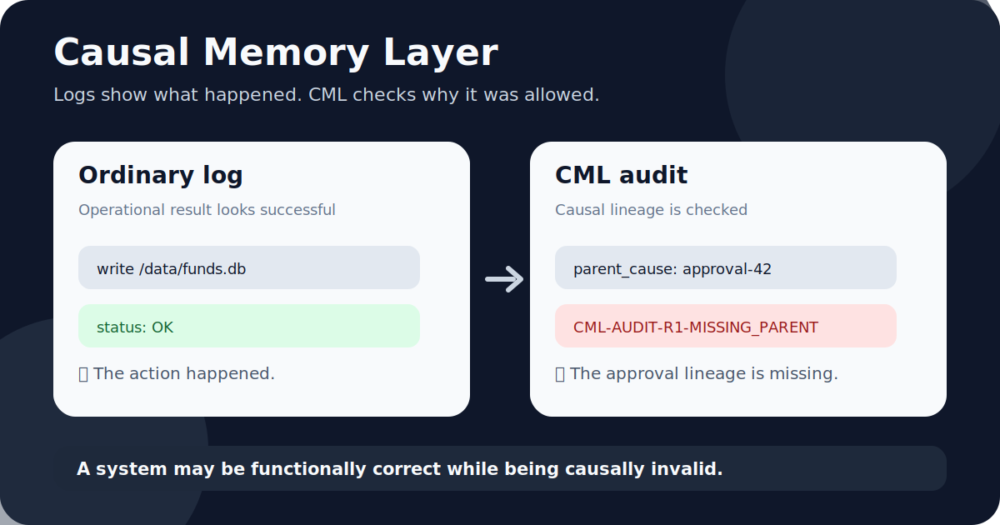

# Causal Memory Layer (CML)

[](https://github.com/safal207/Causal-Memory-Layer/actions/workflows/ci.yml)
[](https://github.com/safal207/Causal-Memory-Layer/actions/workflows/python-package-validation.yml)
[](https://pypi.org/project/causal-memory-layer/)
[](https://pypi.org/project/causal-memory-layer/)
[](https://github.com/safal207/Causal-Memory-Layer/actions/workflows/pypi-install-smoke.yml)


[](docs/evidence/BENCHMARK_EVIDENCE_SNAPSHOT.md)



## Why CML?

**Logs show what happened. CML checks why it was allowed.**

A workflow can pass every functional test and still be causally invalid: the action succeeded, but the approval, intent, or responsibility lineage is missing, ambiguous, or broken.

```text
ordinary log:  action completed -> OK
CML audit:     parent_cause=approval-42 -> MISSING_PARENT
```

CML is an open-source causal audit layer for structured action traces, AI-agent workflows, high-trust automation, and reviewable safety infrastructure.

> A system may be functionally correct while being causally invalid.

## What problem this solves

Modern agent systems can execute tools, call APIs, write files, and send messages faster than humans can review every step.

Most logs tell you that an action happened; they do not prove that the action had a valid upstream approval, task, or responsibility path.

CML adds a small audit primitive for this gap: it checks structured action traces for missing parent causes, ambiguous roots, and broken causal lineage.

This is useful when an agent action succeeds operationally but should still be reviewed because its permission or responsibility chain is missing.

The goal is not to replace observability, policy engines, or security tooling; it is to make causal validity inspectable.

**Star this repo if you care about auditable AI agents, deterministic oversight, causal traces, and open-source AI safety infrastructure.**

## Install

Install from PyPI:

```bash
pip install causal-memory-layer
```

Check the CLI:

```bash
cml --help
```

Install the experimental MCP extra:

```bash
pip install "causal-memory-layer[mcp]"
cml-mcp
```

Current production release:

```bash
pip install causal-memory-layer==0.4.0
```

## 30-second demo

Run the local API:

```bash
docker compose up --build
```

Then follow the Docker walkthrough:

```text
docs/demo/DOCKER_CAUSAL_MEMORY_WALKTHROUGH.md
```

Expected example finding:

```text
CML-AUDIT-R1-MISSING_PARENT
```

The action may look operationally valid, but CML asks whether its causal parent exists.

For an agent-workflow example, run the CrewAI-style causal audit demo:

```bash
python examples/crewai_style_causal_audit.py
```

See [`docs/integrations/CREWAI_STYLE_CAUSAL_AUDIT.md`](docs/integrations/CREWAI_STYLE_CAUSAL_AUDIT.md).

For a cyber-agent approval-lineage example, run:

```bash
python examples/cyber_patch_to_poc_audit.py
```

See [`docs/demo/CYBER_AGENT_APPROVAL_AUDIT.md`](docs/demo/CYBER_AGENT_APPROVAL_AUDIT.md).

## Use CML when you need to audit

- AI-agent tool calls and action chains.
- Human approval handoffs.
- Security-agent high-risk action approval lineage.
- Automation workflows with high-trust actions.
- Fintech or review-heavy decision paths.
- Structured traces where responsibility lineage matters.
- Research benchmarks for causal validity in agentic systems.

## Agent-audit MCP integration

CML can also run as an experimental MCP tool server for AI-agent audit workflows.

From PyPI:

```bash
pip install "causal-memory-layer[mcp]"
cml-mcp
```

For local development:

```bash
pip install -e ".[mcp]"
cml-mcp
```

See [`docs/integrations/MCP_AGENT_AUDIT.md`](docs/integrations/MCP_AGENT_AUDIT.md) for local MCP client setup and available tools.

For a short coding-assistant setup path, see [`docs/integrations/CURSOR_MCP_QUICKSTART.md`](docs/integrations/CURSOR_MCP_QUICKSTART.md).

## How CML differs

| System type | Usually answers | CML adds |
| :--- | :--- | :--- |
| Logs | What happened? | Was the action causally permitted? |
| Tracing | Where did execution go? | Did responsibility lineage survive the workflow? |
| Observability | What failed operationally? | What succeeded but had broken causal lineage? |
| Policy checks | Is this allowed now? | Why was this specific action allowed in this trace? |
| CML | Why was this action allowed? | Narrow audit primitive, not a full runtime safety stack. |

## Audit codes

CML findings are intentionally small and reviewable.

| Code | Meaning | Why it matters |
| :--- | :--- | :--- |
| `CML-AUDIT-R1-MISSING_PARENT` | A record points to a `parent_cause` that does not exist in the trace. | The action may have succeeded, but its approval/task lineage is broken. |
| `CML-AUDIT-R2-GAP_NOT_MARKED` | A record has no parent but is not clearly marked as an observed causal gap. | Reviewers cannot tell whether the missing parent is intentional or accidental. |
| `CML-AUDIT-R3-SECRET_NET_MISSING_CHAIN` | A network/send action follows secret access without a valid causal chain. | Useful for reviewing high-risk data-flow and exfiltration-like patterns. |
| `CML-AUDIT-R4-AMBIGUOUS_ROOT` | A root event label looks malformed or ambiguous. | Root authority should be explicit, not guessed from a near-miss string. |

These codes do not block execution or certify safety. They make causal-risk patterns visible for review.

See [`docs/audit/FINDINGS_GLOSSARY.md`](docs/audit/FINDINGS_GLOSSARY.md) for more detail.

## Fast validation

```bash
pip install -e ".[dev]"
pytest
python scripts/run_safety_eval.py
```

Dashboard:

```text
https://safal207.github.io/Causal-Memory-Layer/
```

## Review links

- Start here: [`docs/START_HERE.md`](docs/START_HERE.md)
- Reviewer path: [`docs/REVIEWER_PATH.md`](docs/REVIEWER_PATH.md)
- Research map: [`docs/research/CML_RESEARCH_MAP.md`](docs/research/CML_RESEARCH_MAP.md)
- Non-claims: [`docs/NON_CLAIMS.md`](docs/NON_CLAIMS.md)
- Portfolio relationship: [`docs/PORTFOLIO_RELATIONSHIP.md`](docs/PORTFOLIO_RELATIONSHIP.md)
- Benchmark evidence: [`docs/evidence/BENCHMARK_EVIDENCE_SNAPSHOT.md`](docs/evidence/BENCHMARK_EVIDENCE_SNAPSHOT.md)
- Grant evidence pack: [`docs/evidence/GRANT_EVIDENCE_CML_0.4.0.md`](docs/evidence/GRANT_EVIDENCE_CML_0.4.0.md)
- External validation protocol: [`docs/evidence/EXTERNAL_VALIDATION_PROTOCOL.md`](docs/evidence/EXTERNAL_VALIDATION_PROTOCOL.md)
- Technical report outline: [`docs/research/TECHNICAL_REPORT_OUTLINE.md`](docs/research/TECHNICAL_REPORT_OUTLINE.md)
- Funding / research evidence: [`docs/GRANT_EVIDENCE.md`](docs/GRANT_EVIDENCE.md)
- Docker walkthrough: [`docs/demo/DOCKER_CAUSAL_MEMORY_WALKTHROUGH.md`](docs/demo/DOCKER_CAUSAL_MEMORY_WALKTHROUGH.md)
- CrewAI-style causal audit demo: [`examples/crewai_style_causal_audit.py`](examples/crewai_style_causal_audit.py)
- CrewAI-style integration note: [`docs/integrations/CREWAI_STYLE_CAUSAL_AUDIT.md`](docs/integrations/CREWAI_STYLE_CAUSAL_AUDIT.md)
- Cyber-agent approval audit demo: [`examples/cyber_patch_to_poc_audit.py`](examples/cyber_patch_to_poc_audit.py)
- Cyber-agent approval audit walkthrough: [`docs/demo/CYBER_AGENT_APPROVAL_AUDIT.md`](docs/demo/CYBER_AGENT_APPROVAL_AUDIT.md)
- MCP agent-audit integration: [`docs/integrations/MCP_AGENT_AUDIT.md`](docs/integrations/MCP_AGENT_AUDIT.md)
- Cursor MCP quickstart: [`docs/integrations/CURSOR_MCP_QUICKSTART.md`](docs/integrations/CURSOR_MCP_QUICKSTART.md)
- Cause Band concept: [`docs/research/CAUSE_BAND.md`](docs/research/CAUSE_BAND.md)
- Cause Band trajectory walkthrough: [`docs/demo/CAUSE_BAND_TRAJECTORY_WALKTHROUGH.md`](docs/demo/CAUSE_BAND_TRAJECTORY_WALKTHROUGH.md)
- Agent intent drift example: [`docs/demo/AGENT_INTENT_DRIFT_CAUSE_BAND_EXAMPLE.md`](docs/demo/AGENT_INTENT_DRIFT_CAUSE_BAND_EXAMPLE.md)
- Dormant Causal Patterns: [`docs/research/DORMANT_CAUSAL_PATTERNS.md`](docs/research/DORMANT_CAUSAL_PATTERNS.md)
- Temporal Causal Watchpoints: [`docs/research/TEMPORAL_CAUSAL_WATCHPOINTS.md`](docs/research/TEMPORAL_CAUSAL_WATCHPOINTS.md)
- Experimental Cause Band audit flag: [`docs/experimental/CAUSE_BAND_AUDIT_FLAG.md`](docs/experimental/CAUSE_BAND_AUDIT_FLAG.md)
- Quantum causal audit future direction: [`docs/research/QUANTUM_CAUSAL_AUDIT_FUTURE_DIRECTION.md`](docs/research/QUANTUM_CAUSAL_AUDIT_FUTURE_DIRECTION.md)
- Causal invalidity patterns: [`docs/research/CAUSAL_INVALIDITY_PATTERNS.md`](docs/research/CAUSAL_INVALIDITY_PATTERNS.md)
- Audit findings glossary: [`docs/audit/FINDINGS_GLOSSARY.md`](docs/audit/FINDINGS_GLOSSARY.md)
- LTP / CML bridge: [`docs/LTP_CML_BRIDGE.md`](docs/LTP_CML_BRIDGE.md)
- Roadmap: [`ROADMAP.md`](ROADMAP.md)
- Security: [`SECURITY.md`](SECURITY.md)
- License: [`LICENSE`](LICENSE)

## Current artifact

This repository already contains a working technical artifact, not only a concept.

Current components include:

- Python causal validation and audit engine;
- causal chain reconstruction utilities;
- CLI commands for lineage validation and chain inspection;
- API layer and store interface;
- example logs and audit outputs;
- CrewAI-style agent trace causal audit example;
- cyber-agent approval-lineage causal audit example;
- tests for chain logic, audit rules, and CTAG behavior;
- API smoke tests for health, audit, and CTAG decode;
- deterministic safety-eval benchmark with fixtures and tracked results;
- documentation for vCML semantics and audit rules.

Key implementation entry points:

- `cml/audit.py`
- `cml/chain.py`
- `cli/main.py`
- `api/server.py`
- `examples/crewai_style_causal_audit.py`
- `examples/cyber_patch_to_poc_audit.py`
- `tests/test_audit.py`
- `tests/test_cyber_patch_to_poc_demo.py`
- `tests/test_api_smoke.py`

## Problem

Many systems record events, outputs, traces, and metrics, but do not validate the causal structure behind authorization and action.

That creates blind spots such as:

- actions that appear valid but have no grounded parent cause;
- ambiguous or malformed root authority;
- actions that succeed operationally while losing approval lineage;
- state transitions that cannot be tied back to intent, permission, and responsibility.

For agentic systems, this matters because output review alone can miss causally invalid action chains.

## What CML does

CML checks whether a high-trust action or state transition was causally valid, not only whether it occurred.

It focuses on:

- validating causal links between actions and prior authorization;
- preserving responsibility lineage across multi-step workflows;
- checking intent and permission continuity across transitions;
- detecting suspicious or invalid lineage such as missing parents, malformed roots, or broken handoffs;
- validating causal coherence from structured logs and traces.

## Evidence snapshot

- Production PyPI package: `pip install causal-memory-layer`
- Production release: `causal-memory-layer==0.4.0`
- Production PyPI install smoke test: [`pypi-install-smoke.yml`](https://github.com/safal207/Causal-Memory-Layer/actions/workflows/pypi-install-smoke.yml)
- Grant evidence pack: `docs/evidence/GRANT_EVIDENCE_CML_0.4.0.md`
- CrewAI-style integration example: `examples/crewai_style_causal_audit.py`
- Cyber-agent approval audit example: `examples/cyber_patch_to_poc_audit.py`
- CrewAI outreach issue: https://github.com/crewAIInc/crewAI/issues/6063
- Deterministic benchmark fixtures with expected audit findings: `benchmarks/fixtures/`
- Current tracked benchmark result: `6/6 matched`
- Benchmark runner: `python scripts/run_safety_eval.py`
- Tracked report: `benchmarks/RESULTS.md`
- Reviewer-friendly benchmark interpretation: `docs/evidence/BENCHMARK_EVIDENCE_SNAPSHOT.md`
- Larger-grant expansion path: `docs/evidence/BENCHMARK_EXPANSION_PLAN_50K_100K.md`
- External validation protocol: `docs/evidence/EXTERNAL_VALIDATION_PROTOCOL.md`

## External reproducibility evidence

External validation notes will be listed here as they are contributed.

Current external validation tasks:

- Full local validation path: [`#77`](https://github.com/safal207/Causal-Memory-Layer/issues/77)
- MCP demo runner validation: [`#123`](https://github.com/safal207/Causal-Memory-Layer/issues/123)

Validation note template:

```text
docs/evidence/external_validation/TEMPLATE_MCP_DEMO_RUNNER.md
```

This section is intentionally evidence-first: it should only list external notes after they are contributed. It does not claim production safety, compliance readiness, enforcement behavior, or stable Cause Band semantics.

## Repository map

- `cml/`: core Python implementation
- `cli/`: command-line tooling
- `api/`: API and store layer
- `vcml/`: vCML semantics, format, audit, and boundary docs
- `examples/`: sample logs and reports
- `benchmarks/`: deterministic benchmark fixtures and results
- `tests/`: regression coverage
- `docs/`: supporting docs for review, research, and deployment

## Scope

CML does not claim to solve all AI safety, security, or compliance problems.

It contributes one focused primitive:

```text
causal-validity checking for structured action traces
```

See [`docs/NON_CLAIMS.md`](docs/NON_CLAIMS.md) for the full scope boundary.

## Research direction

The strongest research direction for CML is causal validity checking for agentic oversight.

A useful framing is:

> How can we detect actions that appear valid at the surface level but are causally invalid because authorization, approval, or responsibility lineage is missing, ambiguous, or broken?

## Bottom line

A system may be functionally correct while being causally invalid.

CML exists to make that distinction inspectable.
