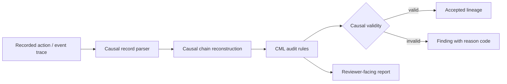

# Grant Evidence Package

Status: reviewer-facing evidence package.

Scope: this document summarizes the current Causal Memory Layer artifact, reproducible reviewer path, evidence assets, explicit non-claims, and near-term research roadmap for grant reviewers.

## One-sentence claim

Causal Memory Layer (CML) is an open-source causal audit layer for detecting actions that appear operationally valid but are causally invalid because authorization, intent, approval, or responsibility lineage is missing, ambiguous, or broken.

## Core invariant

```text
A system may be functionally correct while being causally invalid.
```

CML exists to make that distinction inspectable and testable.

## Reviewer path

A reviewer should be able to validate the current artifact locally without private services or external APIs.

```bash
pip install -e ".[dev]"
pytest
```

Benchmark / safety-eval path:

```bash
python scripts/run_safety_eval.py
```

Core CLI examples:

```bash
python -m cli.main audit examples/exec_causal_log.jsonl
python -m cli.main audit examples/secret_to_net_log.jsonl
```

## Architecture at a glance



CML is not the executor, transport, or storage engine. It validates whether recorded action chains preserve authorization lineage, intent continuity, and responsibility.

## Current evidence matrix

| Evidence asset | Reviewer question | Path | Current status |
| --- | --- | --- | --- |
| Unit tests | Do audit rules and causal chain reconstruction behave deterministically? | `tests/` | Implemented |
| Safety benchmark | Can known causal-validity failure classes be reproduced? | `scripts/run_safety_eval.py`, `benchmarks/fixtures/`, `benchmarks/RESULTS.md` | Implemented |
| Missing parent demo | Can CML detect actions whose parent authorization is absent? | `examples/privileged_action_missing_authorization_log.jsonl` | Implemented example |
| Secret-to-network demo | Can CML surface sensitive access followed by outbound behavior without valid lineage? | `examples/secret_to_net_log.jsonl`, `examples/secret_to_net_explain.md` | Implemented example |
| Multi-hop QA mismatch | Can CML expose a plausible reasoning chain that diverged from the required causal edge? | `examples/multihop_qa_mismatch_log.jsonl`, `examples/multihop_qa_mismatch_explain.md` | Implemented example |
| vCML semantics | Are record semantics and audit boundaries documented? | `vcml/`, `docs/` | Documented |
| Security hygiene | Does the repository avoid clear-text logging of sensitive monitor config? | `vcml/linux-ebpf/file_monitor.py` | Improved via security fix |

## What is already implemented

- Python causal validation and audit engine.
- Causal chain reconstruction utilities.
- CLI audit surface for JSONL logs.
- API/store layer scaffolding.
- Example logs and walkthrough reports.
- Regression tests for audit logic and causal chain behavior.
- Deterministic safety-eval benchmark with tracked results.
- vCML documentation for causal semantics and audit boundaries.
- Basic security hygiene around sensitive logging in the file monitor.

## What CML detects

CML is designed to detect or make inspectable failure classes such as:

- missing parent authorization,
- malformed or ambiguous root authority,
- unmarked causal gaps,
- secret access followed by network behavior without valid lineage,
- broken responsibility lineage across handoffs,
- policy-specific authorization-lineage violations,
- plausible output traces that are causally disconnected from required evidence.

## What this project does not claim yet

CML currently does not claim:

- full AI alignment,
- runtime enforcement,
- production IAM integration,
- production incident response automation,
- complete prevention of unsafe actions,
- certified compliance or cybersecurity protection,
- replacement of observability stacks, SIEMs, EDR, or tracing systems.

The current value is narrower: reproducible causal-validity checking over structured action traces.

## Why this is grant-relevant

Advanced AI agents increasingly perform actions rather than only generate text. Output review alone can miss cases where an action succeeds operationally but lacks valid authorization lineage.

CML contributes one testable safety primitive:

```text
recorded action trace -> causal chain reconstruction -> audit rules -> valid / invalid lineage finding
```

This makes a class of agentic safety failures reproducible, benchmarkable, and explainable through reasoned audit findings rather than narrative-only review.

## Research / build roadmap

Near-term grant-funded work can focus on:

1. **Formalize vCML semantics** — make record fields, invariants, and reason codes more precise.
2. **Expand benchmark fixtures** — add more causal-validity failure classes across agentic workflows.
3. **Replay and comparability** — make audit results comparable across model versions and system changes.
4. **Policy hooks** — support domain-specific authorization-lineage rules.
5. **Trace adapters** — connect CML to agent traces, workflow logs, and CI/security events.
6. **Evaluation reports** — publish reproducible benchmark results and expected findings.
7. **Integration boundary docs** — clarify how CML complements LTP/T-Trace/PythiaLabs without conflating roles.

## Relationship to LTP and PythiaLabs

CML answers a different question from LTP and PythiaLabs:

- **CML:** Was this action causally valid under authorization, intent, and responsibility lineage?
- **LTP:** Was this agent execution path inspectable, replayable, anchored, and admissible?
- **PythiaLabs:** Should this proposed high-risk agent action be allowed, blocked, or escalated before tools are called?

Together they form complementary layers, but CML is useful independently as a causal-validity audit primitive.

## Suggested grant reviewer checklist

A reviewer can ask:

- Can I run tests locally?
- Can I reproduce benchmark findings?
- Does the system emit reasoned audit findings rather than only logs?
- Are the non-claims explicit?
- Is the failure class important for agentic systems?
- Is the artifact already implemented enough to support research iteration?

## Current strongest positioning

Use this formulation in applications:

```text
Causal Memory Layer is an open-source causal audit layer for detecting actions that look operationally correct but are causally invalid because authorization, intent, approval, or responsibility lineage is missing, ambiguous, or broken.
```
