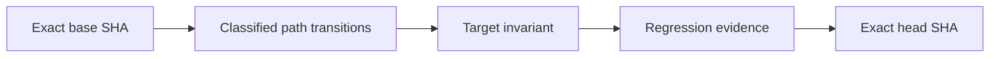

# Causal PR Gate

The `Causal PR Gate` turns every pull request into a reviewable state transition rather than treating a green test run as sufficient proof.

## What always runs

For every pull request, regardless of its target branch, the workflow:

1. checks out the exact pull-request head from the actual source repository;
2. binds the report to the exact base SHA and target branch;
3. computes a rename-aware base-to-head diff and classifies both the source and destination of a rename;
4. classifies implementation, workflow, test, documentation, and unknown changes;
5. treats every non-documentation or unknown tracked format as strict by default;
6. validates the causal-review contract in the pull-request body;
7. builds JSON and Mermaid cause-to-transition evidence;
8. verifies pinned actions, least permissions, fail-closed artifact handling, and exact-head checkout across all required workflows;
9. runs mutation and regression tests for the gate itself;
10. re-reads the target branch tip before lane evidence and again before the final manifest;
11. publishes exact-head and exact-base evidence tied to the run ID and attempt;
12. exposes the stable required-check name `Causal PR Gate`.

## Strict and lightweight policy

### Strict mode

Strict mode applies to every change that is not documentation-only. This includes runtime code, extensions, packages, schemas, containers, infrastructure, configuration, workflows, tests, unknown tracked formats, and either side of a rename.

The pull-request body must contain non-placeholder sections named:

- `Failure path`;
- `Invariant after change`;
- `Regression evidence`;
- `Residual risk`.

The change must also include a changed test or cite an existing test by exact repository path. Referenced paths are resolved inside the repository and cannot escape it. Changes to required workflows must change either `tests/test_ci_workflow_contract.py` or `tests/test_causal_pr_contract.py`.

### Lightweight mode

Only documentation-only transitions receive lightweight mode. Markdown, reStructuredText, AsciiDoc, recognized repository documents, and documentation media are eligible. A script located under `docs/` is still executable and therefore strict. Unknown extensions fail closed into strict mode.

## Generated graph

Each report records this transition:



The JSON report contains both sides of renames, all classified paths, sanitized section summaries, referenced existing tests, graph nodes and edges, violations, and the pass/fail result.

## Base freshness

The workflow confirms through the GitHub API that the observed target-branch tip still equals the event's exact base SHA:

- once after analysis and mutation tests;
- again immediately before the final evidence manifest.

Both observations are included in the final evidence manifest. If the target branch moves during the run, the gate fails rather than publishing stale evidence.

A base branch can still advance after a successful run. Therefore every protected target branch must enable **Require branches to be up to date before merging**, represented by `required_status_checks.strict: true` in classic branch protection. This external rule blocks merge until the PR head is updated; the resulting `synchronize` event reruns the gate against the new base.

The bootstrap is not complete until both controls are enabled for each protected target branch:

1. `Causal PR Gate` is a required status check;
2. **Require branches to be up to date before merging** is enabled.

An owner with repository administration read permission can verify classic protection with:

```bash
gh api repos/OWNER/REPO/branches/BRANCH/protection/required_status_checks \
  --jq '{strict,contexts,checks}'
```

The returned object must show `strict: true` and include the required causal check. Repositories using rulesets must enforce the equivalent up-to-date-base and required-check rules.

## Trust boundaries

The gate proves that the declared transition and regression evidence are attached to one exact pull-request head and one exact base observation. It does not replace:

- CI test matrices;
- package validation;
- dependency, secret, and CodeQL scans;
- CodeRabbit, Codex, or human review;
- repository branch protection or rulesets;
- deployment or live-service evidence.

Review evidence supports a merge decision but never grants merge authority.

## Repository protection

This workflow changes the protected CI trust root and therefore requires a dedicated bootstrap review. After it is merged to the default branch, configure every protected target branch to require `Causal PR Gate` alongside the existing CI, package, security, and trust-root checks, and require branches to be current before merge.

Required status checks plus up-to-date-base enforcement are the merge boundary. Without those repository settings, the workflow still produces evidence but cannot prevent an administrator or alternate merge path from accepting stale evidence.

## Failure recovery

When the gate fails:

1. open the `causal-pr-report.md` and base-freshness artifacts;
2. read the explicit violations;
3. update the PR causal-review sections or regression evidence;
4. update the branch when the base branch has moved;
5. push a bounded fix or edit the PR body;
6. let the gate rerun against the new exact head and base.

Do not suppress the gate, use `continue-on-error`, loosen artifact handling, replace full action SHAs with mutable tags, or disable up-to-date-base protection to make a merge appear green.
