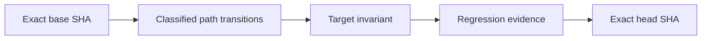

# Causal PR Gate

CML evaluates a pull request through two independent trust lanes. A green test run is evidence, not proof.

## Trust lanes

### Base-trusted identity lane

`.github/workflows/trusted-pr-gate.yml` runs on every `pull_request_target` without a target-branch filter. It:

1. derives a branch-specific context:

   ```text
   CML Trust Root Gate / SHA256(UTF-8 target branch name)
   ```

2. resolves the pull request's exact base ref, base SHA, head repository, head SHA, and current **test merge commit** SHA through the GitHub API;
3. checks out the exact base into `base`;
4. checks out the exact head into isolated `subject`;
5. executes only `base/.github/trust-root/scripts/verify_subject.py`;
6. treats the subject checkout as untrusted data;
7. records the exact base, head, merge SHA, and context in evidence;
8. publishes the branch-scoped trust status to the current test merge commit, not to the reusable head commit.

Publishing to the test merge commit closes two status-reuse classes:

- one head used against two target branches has different merge commits and different branch contexts;
- when the same target branch advances, GitHub produces a new test merge commit, so a success attached to the old merge commit cannot satisfy the current pull request.

The publish job re-reads the pull request immediately before posting. If any base, head, repository, or merge identity changed, it refuses to publish stale status.

### Default-branch refresh lane

`.github/workflows/trust-root-refresh.yml` is a trusted orchestrator that runs from the default branch every five minutes. It deliberately has **no `push` or `workflow_dispatch` trigger**, because either event can load workflow code from a selectable non-default ref that must not receive `statuses: write` authority.

`CML Trust Root Refresh`:

1. enumerates every open pull request and its current exact base/head/test-merge identity;
2. marks the branch-specific context `pending` on the current test merge commit;
3. checks out the exact target base and exact subject;
4. executes the verifier from the target base only;
5. re-reads the pull request after verification;
6. publishes success or failure only when the transition is still identical;
7. uploads the exact verification and freshness evidence.

A base advance therefore invalidates the old status immediately by changing the test merge SHA. The scheduled refresh restores a decision for the new test merge without requiring a head-branch commit.

Open pull requests for which GitHub cannot produce a current test merge commit (for example, a conflicting PR) are recorded as skipped and receive no refreshed trust status. They cannot block refresh for unrelated mergeable PRs, and the missing status remains fail-closed for the skipped PR.

### Head-executed causal lane

`.github/workflows/causal-pr.yml` runs for every pull request target. It:

1. checks out the exact head from the actual source repository;
2. fetches complete base ancestry without shallow-boundary options;
3. requires the exact base to be an ancestor of the head;
4. computes a direct base-to-head diff and retains both sides of renames;
5. classifies implementation, workflow, test, documentation, and unknown paths;
6. validates the PR's causal sections;
7. requires surviving executable regression evidence for strict changes;
8. emits JSON and Mermaid transition evidence;
9. rechecks the target branch before lane evidence and before the final manifest;
10. exposes the stable required check `Causal PR Gate`.

The causal lane cannot authenticate its own implementation. The base-trusted lane authenticates the protected analyzer, workflow contracts, and blob identities.

## Strict and lightweight policy

Strict mode applies to every transition that is not genuine documentation-only work. It includes runtime code, packages, schemas, containers, infrastructure, configuration, workflows, tests, unknown formats, and either side of a rename.

Strict PRs must contain exactly one non-placeholder section for each heading:

- `Failure path`;
- `Invariant after change`;
- `Regression evidence`;
- `Residual risk`.

A strict transition also requires a surviving executable changed test or an exact existing executable test path. Test evidence must be a regular repository file reached without any symlink component. Deleted files, documentation files, symlinks, gitlinks, directories, and paths outside the checkout grant no regression credit.

Lightweight mode is limited to documentation entries whose exact Git mode is the regular non-executable blob mode `100644`. Executable mode `100755`, symlink mode `120000`, gitlink mode `160000`, mixed modes, missing modes, and unknown modes are strict.

## Causal graph



The report is evidence for a transition, not merge authority.

## Required repository settings

After the bootstrap merge, every protected target branch must require:

1. its branch-specific `CML Trust Root Gate / <SHA-256>` context;
2. `Causal PR Gate`;
3. the existing CI, package, and security gates;
4. **Require branches to be up to date before merging**, represented by `required_status_checks.strict: true` for classic branch protection or the equivalent ruleset control.

Compute a branch context with:

```bash
BRANCH=main python - <<'PY'
import hashlib
import os

branch = os.environ["BRANCH"]
print("CML Trust Root Gate / " + hashlib.sha256(branch.encode("utf-8")).hexdigest())
PY
```

Compute it separately for `main`, every release branch, and every protected maintenance branch. Never reuse one branch's trust context for another branch.

Verify classic protection with:

```bash
gh api repos/OWNER/REPO/branches/BRANCH/protection/required_status_checks \
  --jq '{strict,contexts,checks}'
```

The result must show `strict: true`, `Causal PR Gate`, and that branch's exact trust-root context.

## Trust boundaries

The base-trusted lane proves that protected CI identities match the target branch's approved trust root. The refresh lane ensures current test merge commits receive current decisions. The causal lane proves that one declared transition and its regression evidence bind to exact base/head observations.

They do not replace:

- human, Codex, or CodeRabbit review;
- branch protection or rulesets;
- CI matrices, package validation, dependency audit, secret scan, or CodeQL;
- deployment and live-service evidence.

Anyone with administrative bypass authority can still override repository policy. Review evidence supports a merge decision but never grants merge authority.

## Failure recovery

When a trust status is missing after a base advance:

1. confirm the PR shows a new test merge commit;
2. wait for the scheduled `CML Trust Root Refresh` run;
3. inspect `trust-root-verification.json` and `transition-freshness.json`;
4. confirm `base_ref`, `base_sha`, `head_sha`, `merge_sha`, and `status_context` match the current PR;
5. update the branch or fix the protected-file mismatch;
6. rerun both trust lanes.

Do not add a `push` trigger with write authority, execute subject helpers, publish trust status to the head commit, reuse another branch's context, suppress freshness failures, loosen artifact handling, or disable strict up-to-date-base protection.
