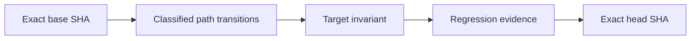

# Causal PR Gate

The `Causal PR Gate` turns every pull request into a reviewable state transition rather than treating a green test run as sufficient proof.

## What always runs

Every pull request, regardless of its target branch, receives two independent trust lanes.

The base-trusted `CML Trust Root Gate` runs through `pull_request_target` without target-branch filters. It:

1. derives a stable branch-scoped status context from the SHA-256 digest of the exact target branch name;
2. checks out the exact target-branch base SHA into an isolated `base` directory;
3. checks out the exact pull-request head from its actual source repository into an isolated `subject` directory;
4. executes only `base/.github/trust-root/scripts/verify_subject.py`;
5. treats the subject checkout as untrusted data and never imports or executes its verifier;
6. compares protected workflow and CI identities against the manifest from the exact target base;
7. records the exact base ref, base SHA, and branch-scoped status context in the trust evidence;
8. publishes that branch-scoped status on the exact head SHA.

The context format is:

```text
CML Trust Root Gate / SHA256(UTF-8 target branch name)
```

A shared head commit used by PRs against two different branches therefore receives two different status contexts. A successful maintenance-branch verification cannot overwrite or satisfy a failed `main` verification.

The head-executed `Causal PR Gate` then:

1. checks out the exact pull-request head from the actual source repository;
2. binds the report to the exact base SHA and target branch;
3. computes a rename-aware base-to-head diff and classifies both the source and destination of a rename;
4. classifies implementation, workflow, test, documentation, and unknown changes;
5. treats every non-documentation or unknown tracked format as strict by default;
6. validates the causal-review contract in the pull-request body;
7. builds JSON and Mermaid cause-to-transition evidence;
8. verifies pinned actions, least permissions, fail-closed artifact handling, and exact-head checkout across all required workflows;
9. runs mutation and regression tests for the gate itself;
10. re-reads the target branch tip before lane evidence and again before the final manifest;
11. publishes exact-head and exact-base evidence tied to the run ID and attempt;
12. exposes the stable required-check name `Causal PR Gate`.

The causal lane cannot authenticate its own implementation. Only the target branch's base-trusted lane can establish that the analyzer, workflow validator, selected regression tests, and protected blob identities are approved by that target's trust root.

## Strict and lightweight policy

### Strict mode

Strict mode applies to every change that is not documentation-only. This includes runtime code, extensions, packages, schemas, containers, infrastructure, configuration, workflows, tests, unknown tracked formats, and either side of a rename.

The pull-request body must contain non-placeholder sections named:

- `Failure path`;
- `Invariant after change`;
- `Regression evidence`;
- `Residual risk`.

The change must also include a changed test or cite an existing test by exact repository path. Referenced paths are resolved inside the repository and cannot escape it. Changes to required workflows must change either `tests/test_ci_workflow_contract.py` or `tests/test_causal_pr_contract.py`.

### Lightweight mode

Only documentation-only transitions receive lightweight mode. Markdown, reStructuredText, AsciiDoc, recognized repository documents, and documentation media are eligible only when their exact Git mode is the regular non-executable blob mode `100644`. Executable blobs, symlinks, gitlinks, mixed modes, missing modes, and unknown modes are strict. A script located under `docs/` is still executable and therefore strict. Unknown extensions fail closed into strict mode.

## Generated graph

Each report records this transition:



The JSON report contains both sides of renames, all classified paths, sanitized section summaries, referenced existing tests, graph nodes and edges, violations, and the pass/fail result.

## Base freshness

The causal workflow confirms through the GitHub API that the observed target-branch tip still equals the event's exact base SHA:

- once after analysis and mutation tests;
- again immediately before the final evidence manifest.

Both observations are included in the final evidence manifest. If the target branch moves during the run, the gate fails rather than publishing stale evidence.

A base branch can still advance after a successful run. Therefore every protected target branch must enable **Require branches to be up to date before merging**, represented by `required_status_checks.strict: true` in classic branch protection. This external rule blocks merge until the PR head is updated; the resulting `synchronize` event reruns both trust lanes against the new base.

## Required status contexts

The bootstrap is not complete until all three controls are enabled for every protected target branch:

1. the branch-specific `CML Trust Root Gate / <SHA-256>` context is required;
2. `Causal PR Gate` is required;
3. **Require branches to be up to date before merging** is enabled.

Compute the exact trust-root context for a branch with:

```bash
BRANCH=main python - <<'PY'
import hashlib
import os

branch = os.environ["BRANCH"]
print("CML Trust Root Gate / " + hashlib.sha256(branch.encode("utf-8")).hexdigest())
PY
```

For example, compute the context separately for `main`, each release branch, and each protected maintenance branch. Never reuse one branch's trust-root context in another branch's protection rules.

An owner with repository administration read permission can verify classic protection with:

```bash
gh api repos/OWNER/REPO/branches/BRANCH/protection/required_status_checks \
  --jq '{strict,contexts,checks}'
```

The returned object must show `strict: true`, include `Causal PR Gate`, and include the branch-specific trust-root context computed above. Repositories using rulesets must enforce the equivalent up-to-date-base and required-check rules.

## Trust boundaries

The base-trusted gate proves that protected CI identities match the exact target branch's approved manifest. Its status namespace is bound to the target branch identity, while its evidence also records the exact base SHA observed during the run. The causal gate proves that the declared transition and regression evidence are attached to one exact pull-request head and one exact base observation. Neither replaces:

- CI test matrices;
- package validation;
- dependency, secret, and CodeQL scans;
- CodeRabbit, Codex, or human review;
- repository branch protection or rulesets;
- deployment or live-service evidence.

Review evidence supports a merge decision but never grants merge authority.

## Repository protection

This change modifies the protected CI trust root and therefore requires a dedicated bootstrap review. After it is merged to the default branch, configure every protected target branch to require its own branch-scoped trust-root status and `Causal PR Gate` alongside the existing CI, package, and security checks, and require branches to be current before merge.

The `CML Trust Root Gate` workflow itself has no target-branch filter. Its verifier is loaded from the exact target base, while the pull-request head is checked out only as data. A release or maintenance branch therefore evaluates proposed CI changes against its own approved trust root rather than trusting code supplied by the pull request.

Required status checks plus up-to-date-base enforcement are the merge boundary. Without those repository settings, workflows still produce evidence but cannot prevent an administrator or alternate merge path from accepting stale or unauthenticated evidence.

## Failure recovery

When a gate fails:

1. inspect the exact-attempt `trust-root-verification.json`, causal report, and base-freshness artifacts;
2. confirm the evidence contains the intended `base_ref`, `base_sha`, and `status_context`;
3. read the explicit violations;
4. update the PR causal-review sections or regression evidence;
5. update the branch when the base branch has moved;
6. push a bounded fix or edit the PR body;
7. let both gates rerun against the new exact head and base.

Do not suppress either gate, use `continue-on-error`, loosen artifact handling, replace full action SHAs with mutable tags, execute subject trust-root helpers, add target-branch filters, reuse another branch's trust-root status context, or disable up-to-date-base protection to make a merge appear green.
