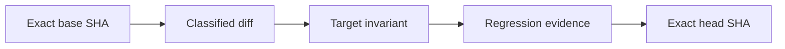

# Causal PR Gate

The `Causal PR Gate` turns every pull request into a reviewable state transition rather than treating a green test run as sufficient proof.

## What always runs

For every pull request targeting `main`, the workflow:

1. checks out the exact pull-request head from the actual source repository;
2. fetches the exact base commit;
3. computes a rename-aware base-to-head diff;
4. classifies implementation, workflow, test, documentation, and other changes;
5. validates the causal-review contract in the pull-request body;
6. builds JSON and Mermaid cause-to-transition evidence;
7. verifies pinned actions, least permissions, fail-closed artifact handling, and exact-head checkout across all required workflows;
8. runs mutation and regression tests for the gate itself;
9. publishes an exact-head evidence manifest;
10. exposes the stable required-check name `Causal PR Gate`.

## Strict and lightweight policy

### Strict mode

Strict mode applies when implementation, workflow, schema, runtime, packaging, or CI-contract files change. The pull-request body must contain non-placeholder sections named:

- `Failure path`;
- `Invariant after change`;
- `Regression evidence`;
- `Residual risk`.

The change must also include a changed test or cite an existing test by exact repository path. Changes to required workflows or their verifier must change either `tests/test_ci_workflow_contract.py` or `tests/test_causal_pr_contract.py`.

### Lightweight mode

Documentation-only and other non-executable changes still produce an exact-head graph and evidence artifact, but do not require the strict causal sections.

## Generated graph

Each report records this transition:

The JSON report contains the changed paths, classification, sanitized section summaries, referenced existing tests, graph nodes and edges, violations, and pass/fail result.

## Trust boundaries

The gate proves that the declared transition and regression evidence are attached to one exact pull-request head. It does not replace:

- CI test matrices;
- package validation;
- dependency, secret, and CodeQL scans;
- CodeRabbit, Codex, or human review;
- repository branch protection;
- deployment or live-service evidence.

Review evidence supports a merge decision but never grants merge authority.

## Repository protection

After this workflow is merged to the default branch, configure the `main` branch ruleset to require `Causal PR Gate` alongside the existing CI, package, security, and trust-root checks. Required status checks are the enforcement boundary that prevents a pull request from bypassing the workflow by changing or deleting it.

## Failure recovery

When the gate fails:

1. open the `causal-pr-report.md` artifact;
2. read the explicit violations;
3. update the PR causal-review sections or regression evidence;
4. push a bounded fix or edit the PR body;
5. let the gate rerun against the new exact head.

Do not suppress the gate, use `continue-on-error`, loosen artifact handling, or replace full action SHAs with mutable tags.
