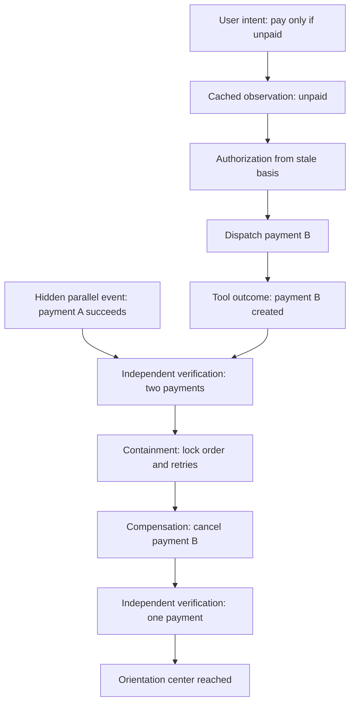

# Multidimensional absurdity trajectory

This synthetic failure-injection scenario demonstrates how individually plausible actions combine into a globally incorrect result, and how a causal execution record recovers through an orientation center and a bounded trajectory.

The machine-readable companion is [`caep.absurdity-trajectory.json`](./caep.absurdity-trajectory.json).

## Orientation center

> A payment is accepted only when intent, authorization, observable state change, and independent verification agree.

The target state requires exactly one successful payment, no duplicate, authorization bound to fresh state, independent verification, and a recovery path known before an external write.

## Causal graph



## Temporal contradiction

The dispatch is modeled as its own event, so the contradiction is directly testable:

```text
valid_time(N3: payment_A_succeeded) < valid_time(N4: payment_B_dispatched)
recorded_time(N3: payment_A_succeeded) > recorded_time(N4: payment_B_dispatched)
```

Payment A therefore succeeds before payment B is dispatched in domain-valid time, but the system records payment A only after the second dispatch.

## Why the result is absurd

1. The cache is structurally valid but stale.
2. The policy engine correctly applies a rule to the wrong state basis.
3. The payment-B dispatch is locally authorized.
4. The MCP tool correctly reports payment B as created.
5. Payment A also correctly succeeds in a parallel process.
6. The system is locally successful and globally wrong.

```text
Tool success != business success != independently accepted transition
```

## Preserved causal chain

The machine-readable CAEP chain contains two records:

```text
caep_diverged_01
  digest: 646b823fed85c726c32fb3edf1133946df909bb826888db2b582e43358dcec73
        ↓ causal parent binding
caep_recovered_01
  digest: ba9cb001d5af40892e93a7737bcbc8f3e2f304a7d1dd56f1a3687bddc27a306b
```

The recovery record cannot validate without the exact divergence record. Changing the parent content while retaining its ID causes digest validation to fail.

## Trajectory selection

| Candidate | Harm | Reversibility | Intent alignment |
|---|---|---|---|
| Do nothing | High | Low | None |
| Cancel both payments | Medium | Medium | Low |
| Lock the order and cancel the newest duplicate | Low | High | High |
| Freeze both and request a human decision | Medium | High | Partial |

The selected path is:

```text
DIVERGED → CONTAINED → COMPENSATED → VERIFIED
```

It is the smallest justified reversible action:

1. block retries and downstream fulfilment;
2. cancel only payment B;
3. independently read the ledger;
4. accept the state only after exactly one successful payment remains.

## Resulting guardrails

- state age must be at most five seconds before an external write;
- authorization must reference the current state digest;
- idempotency must be present;
- independent postcondition verification must be available;
- causal parents must be digest-bound and resolvable;
- malformed or duplicate-key records fail closed.

This artifact is experimental and non-normative.

Disclosure: prepared with AI assistance under human direction and review.
