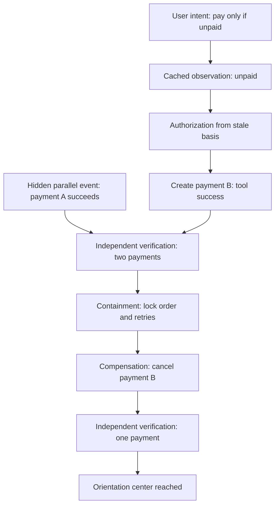

# Multidimensional absurdity trajectory

This synthetic failure-injection scenario demonstrates how individually plausible actions can combine into a globally incorrect result, and how a causal execution record can recover through an orientation center and a bounded trajectory.

The machine-readable companion is [`caep.absurdity-trajectory.json`](./caep.absurdity-trajectory.json).

## Orientation center

The trajectory is evaluated against one stable invariant:

> A payment is accepted only when intent, authorization, observable state change, and independent verification agree.

The target state is:

- exactly one successful payment;
- no duplicate payment;
- authorization bound to fresh state;
- independent verification completed;
- a recovery path available before an external write.

## Dimensions

The same workflow is observed across intent, interpretation, authorization, state, valid time, recorded time, causal parentage, trust, risk, reversibility, and verification.

No private model chain-of-thought is required. The scenario records only externally auditable events, state references, reason codes, policy decisions, and recovery actions.

## Causal graph



## Temporal contradiction

The parallel payment succeeds before the second dispatch in domain-valid time, but its event is recorded afterward:

```text
valid_time(payment_A_succeeded) < valid_time(payment_B_dispatched)
recorded_time(payment_A_succeeded) > recorded_time(payment_B_dispatched)
```

The agent therefore makes a present decision using an observation that is already false in the domain but still appears current in the recorded event stream.

## Why the result is absurd

1. The cache is structurally valid but stale.
2. The policy engine correctly applies a rule to the wrong state basis.
3. The MCP tool correctly reports that it created payment B.
4. Payment A also correctly succeeds in a parallel process.
5. The system is locally successful and globally wrong.

This is the key distinction:

```text
Tool success != business success != independently accepted transition
```

## Trajectory selection

The verifier detects that the postcondition `successful_payment_count == 1` has failed. The system evaluates multiple possible trajectories:

| Candidate | Harm | Reversibility | Intent alignment |
|---|---|---|---|
| Do nothing | High | Low | None |
| Cancel both payments | Medium | Medium | Low |
| Lock the order and cancel the newest duplicate | Low | High | High |
| Freeze both and request a human decision | Medium | High | Partial |

The selected path is:

```text
DIVERGED -> CONTAINED -> COMPENSATED -> VERIFIED
```

It is chosen as the **smallest justified reversible action**:

1. lock new payment attempts and downstream fulfilment;
2. cancel the newest duplicate payment;
3. independently read the ledger;
4. accept the recovered state only when exactly one successful payment remains.

## Final state

The system does not erase the failed transition. It preserves the incident and reaches a new verified state:

```text
successful_payment_count = 1
duplicate_payment_count = 0
incident_recorded = true
causal_gap_detected = true
orientation_center_reached = true
```

The incident also produces new guardrails:

- state freshness must be at most five seconds before an external write;
- authorization must reference the current state digest;
- an idempotency key must be present;
- independent postcondition verification must be available;
- a compensation path must be known before dispatch.

## Relationship to CAEP

The scenario is not a new core MCP primitive. It is a test artifact for evaluating whether CAEP records can reconstruct:

- missing or late causal parents;
- valid-time versus recorded-time divergence;
- expected versus observed postconditions;
- containment and compensation choices;
- movement back toward a declared orientation center.

This artifact is experimental and non-normative.

Disclosure: prepared with AI assistance under human direction and review.
