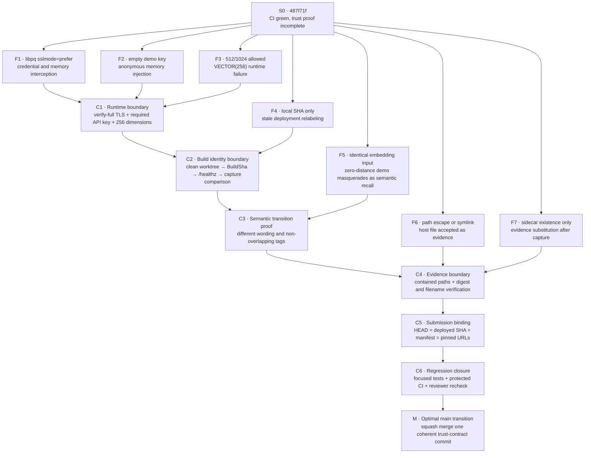

# Causal commit trajectory to `main`

This review treats the branch as a time-ordered state machine. A transition is admissible only when it removes a known failure path and adds a regression test that prevents the state from returning.

Reviewed starting state: `487f71f3bc369163fbe72f2f79ed80cfd8c8ef7b`.

## Trust invariants

| ID | Invariant required before merge |
|---|---|
| I1 | CockroachDB connections verify the server certificate and hostname unless an explicit URL policy overrides it. |
| I2 | Every non-health request is authenticated; an absent demo key fails closed. |
| I3 | Bedrock vector dimensions equal the CockroachDB `VECTOR(256)` schema. |
| I4 | The deployed Lambda reports the exact reviewed Git SHA, and capture rejects any different or malformed SHA. |
| I5 | Semantic proof uses a paraphrase and independent tags rather than identical embedding input. |
| I6 | Evidence paths remain inside the manifest directory, including after symlink resolution. |
| I7 | The ccloud sidecar binds the exact evidence bytes and filename. |
| I8 | Repository and license URLs, manifest SHA, deployed SHA, tests, and the PR head all identify one state. |

## Cause-and-transition graph

## Ordered commit trajectory

The branch keeps small, reviewable commits. Their causal order matters more than file order:

1. **Secure the runtime boundary**
   - default CockroachDB TLS to `verify-full`;
   - require a non-empty demo key in CloudFormation, deployment, and request handling;
   - restrict embeddings to 256 dimensions.
2. **Bind code identity to the deployment**
   - require a clean worktree;
   - pass the exact `git rev-parse HEAD` as `BuildSha`;
   - expose it through `/healthz`;
   - reject capture when runtime SHA and reviewed SHA differ.
3. **Make the semantic claim falsifiable**
   - store a duplicate-refund outcome;
   - query with a reimbursement paraphrase and independent tags;
   - require the original outcome UUID in the decision.
4. **Bind evidence to its origin**
   - contain all evidence paths under the manifest directory;
   - resolve symlinks before acceptance;
   - strictly parse the SHA-256 sidecar and compare both digest and filename.
5. **Bind the final package to one state**
   - require `repository_commit_sha == deployed_build_sha == reviewed HEAD`;
   - require pinned repository and license URLs to contain that SHA.
6. **Close the transition with tests and independent review**
   - run focused Liminal Recall tests, syntax checks, secret scanning, CodeQL, CodeRabbit, and Codex against the exact final head.

## Merge rule

The PR may transition to `main` only when all invariants I1–I8 hold on one exact head, all required checks are successful, and all P1 review threads are either fixed with tests or explicitly rejected with evidence.

A **squash merge** is the optimal `main` trajectory for this refactor: the branch preserves the investigative sequence, while `main` receives one atomic trust-contract change. Review evidence supports the decision but never grants merge authority.

## Post-merge proof

Because `BuildSha` is part of Lambda configuration, any commit added after a live deployment creates a new state. The final head must therefore be deployed again, then the runtime-replacement and submission-gate evidence must be recaptured against that same SHA before Devpost submission.
