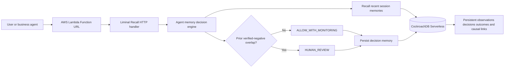

# Liminal Recall architecture

## Memory model

Each record stores:

- a stable UUID;
- a session boundary;
- one of `observation`, `decision`, or `outcome`;
- human-readable content;
- normalized tags;
- status and confidence;
- an optional causal parent memory;
- a database timestamp.

The first demo uses exact tags and token overlap instead of pretending to have semantic certainty. This makes the decision reproducible and easy for judges to inspect.

## Why CockroachDB is meaningful

CockroachDB is not a decorative connection. It is the only durable source of agent memory. The Lambda process is disposable; after a cold start or redeployment, the agent reconstructs its decision context from CockroachDB records.

The final deployment evidence will show:

1. storing a negative outcome;
2. invoking a decision that cites it;
3. forcing a new Lambda execution environment or redeploy;
4. repeating the decision;
5. receiving the same persistent memory reference.

## Why AWS is meaningful

AWS Lambda runs the complete `remember / recall / decide` workflow and exposes the public demo through a Function URL. CloudWatch logs provide execution evidence. A later hardening step may move the database credential to AWS Secrets Manager, but that is not required to prove the first agent-memory loop.

## Trust and authority boundary

- Retrieved memory influences a recommendation; it does not execute the proposed action.
- A negative-memory match produces `HUMAN_REVIEW`, not an automatic destructive action.
- Every response reports `execution.status = NOT_EXECUTED`.
- The token-overlap heuristic is an inspectable MVP baseline, not a claim of complete semantic understanding.
