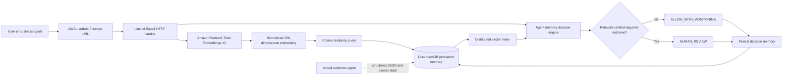

# Liminal Recall architecture

## Memory model

Each record stores:

- a stable UUID;
- a session boundary;
- one of `observation`, `decision`, or `outcome`;
- human-readable content and normalized tags;
- status and confidence;
- an optional causal parent memory;
- a normalized Bedrock embedding;
- a database timestamp.

The vector index uses `session_id`, `kind`, and `status` as exact prefix filters before cosine ranking. This keeps semantic retrieval inside the relevant agent session and verified-negative outcome partition.

## Why CockroachDB is meaningful

CockroachDB is the only durable source of agent memory. Lambda compute is disposable. After a cold start or redeployment, the agent reconstructs decision context from transactional records and their vector embeddings in CockroachDB.

Two required CockroachDB tools have explicit roles:

1. **Distributed Vector Indexing** performs runtime semantic recall over persistent memory.
2. **ccloud CLI** gives the deployment/evidence agent machine-readable cluster identity and state through `-o json`; the committed runbook redacts credentials before evidence is saved.

The final deployment evidence must show `SHOW INDEX`, an `EXPLAIN` plan using vector search, a redacted ccloud evidence manifest, and the same outcome UUID recalled after the Lambda runtime ID changes.

## Why AWS is meaningful

- **AWS Lambda** runs the complete `remember / recall / decide / persist` workflow.
- **Amazon Bedrock** generates Titan Text Embeddings V2 vectors for stored memories and proposed actions.
- **Lambda Function URL** exposes the functional demo.
- **CloudWatch and X-Ray** provide execution and trace evidence.

## Validation boundary

Focused unit tests exercise local handler, security, semantic-mode, and Bedrock contracts. The repository-level protected CI separately imports the application and locks the causal decision, vector-tool reporting, and Titan embedding shape into the parent repository's exact-head validation.

Live vector index use, Bedrock inference, ccloud state, Lambda process replacement, and CockroachDB durability remain external evidence claims until captured from deployed infrastructure.

## Trust and authority boundary

- Retrieved memory influences a recommendation; it never grants execution authority.
- A relevant negative memory produces `HUMAN_REVIEW`, not an automatic destructive action.
- Every decision reports `execution.status = NOT_EXECUTED` and `authority = advisory_only`.
- Database or embedding failure returns a fail-closed `503` with `HUMAN_REVIEW`.
- Optional `x-demo-key` authentication protects non-health routes.
- `runtime_instance_id` proves process replacement; the stable memory UUID proves database durability.
- Semantic similarity is thresholded evidence, not a claim of universal understanding.
