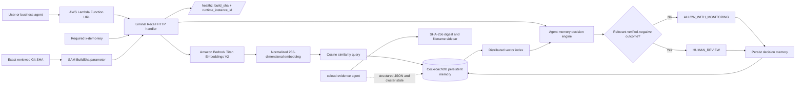

# Liminal Recall architecture


```mermaid
flowchart LR
    U[User or business agent] --> F[AWS Lambda Function URL]
    F --> H[Liminal Recall HTTP handler]
    K[Required x-demo-key] --> H
    S[Exact reviewed Git SHA] --> T[SAM BuildSha parameter]
    T --> H
    H --> Z[/healthz: build_sha + runtime_instance_id/]
    H --> B[Amazon Bedrock Titan Embeddings V2]
    B --> E[Normalized 256-dimensional embedding]
    H --> D[Agent memory decision engine]
    E --> V[Cosine similarity query]
    V --> C[(CockroachDB persistent memory)]
    C --> I[Distributed vector index]
    I --> D
    D --> Q{Relevant verified-negative outcome?}
    Q -->|No| A[ALLOW_WITH_MONITORING]
    Q -->|Yes| R[HUMAN_REVIEW]
    A --> P[Persist decision memory]
    R --> P
    P --> C

    X[ccloud evidence agent] -. structured JSON and cluster state .-> C
    X --> Y[SHA-256 digest and filename sidecar]
```

## Memory model

Each record stores:

- a stable UUID;
- a session boundary;
- one of `observation`, `decision`, or `outcome`;
- human-readable content and normalized tags;
- status and confidence;
- an optional causal parent memory;
- a normalized 256-dimensional Bedrock embedding;
- a database timestamp.

The vector index uses `session_id`, `kind`, and `status` as exact prefix filters before cosine ranking. This keeps semantic retrieval inside the relevant agent session and verified-negative outcome partition. The deployment template allows only 256 dimensions so the embedding contract cannot diverge from `VECTOR(256)`.

## Why CockroachDB is meaningful

CockroachDB is the only durable source of agent memory. Lambda compute is disposable. After a cold start or redeployment, the agent reconstructs decision context from transactional records and their vector embeddings in CockroachDB.

Two required CockroachDB tools have explicit roles:

1. **Distributed Vector Indexing** performs runtime semantic recall over persistent memory.
2. **ccloud CLI** gives the deployment/evidence agent machine-readable cluster identity and state; the checked-in agent redacts credentials before evidence is saved.

Connections default to `sslmode=verify-full` and the packaged CockroachDB root certificate when the database URL does not provide an explicit TLS policy.

The final deployment evidence must show `SHOW INDEX`, an `EXPLAIN` plan using vector search, a redacted ccloud evidence manifest with a verified SHA-256 sidecar, and the same outcome UUID recalled after the Lambda runtime ID changes.

## Why AWS is meaningful

- **AWS Lambda** runs the complete `remember / recall / decide / persist` workflow.
- **Amazon Bedrock** generates Titan Text Embeddings V2 vectors for stored memories and proposed actions.
- **Lambda Function URL** exposes the functional demo and public `/healthz` proof.
- **CloudWatch and X-Ray** provide execution and trace evidence.
- **AWS SAM** binds the deployed configuration to the exact reviewed Git SHA through a required `BuildSha` parameter.

## Artifact-identity boundary

The deployment runner requires a clean worktree and reads `git rev-parse HEAD`. That SHA is passed to SAM, stored as `BUILD_SHA`, and returned by `/healthz`. Capture fails unless the pre-restart and post-restart health responses both report the expected reviewed SHA. The final submission gate then requires:

```text
reviewed HEAD
= repository_commit_sha
= deployed_build_sha
= SHA embedded in repository and license URLs
```

A later commit creates a new state and requires a new deployment and evidence capture.

## Validation boundary

Focused tests exercise handler authentication, TLS defaults, semantic mode, Bedrock dimensions, build identity, path containment, and checksum integrity. Protected repository CI separately imports the application and locks these contracts into exact-head validation.

Live vector-index use, Bedrock inference, ccloud state, Lambda process replacement, and CockroachDB durability remain external evidence claims until recaptured from the exact final deployment.

## Trust and authority boundary

- Retrieved memory influences a recommendation; it never grants execution authority.
- A relevant negative memory produces `HUMAN_REVIEW`, not an automatic destructive action.
- Every decision reports `execution.status = NOT_EXECUTED` and `authority = advisory_only`.
- Database or embedding failure returns a fail-closed `503` with `HUMAN_REVIEW`.
- Required `x-demo-key` authentication protects every non-health route and fails closed when the runtime key is absent.
- `runtime_instance_id` proves process replacement; the stable memory UUID proves database durability; `build_sha` proves artifact identity.
- Semantic similarity is thresholded evidence, not a claim of universal understanding.
